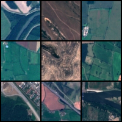
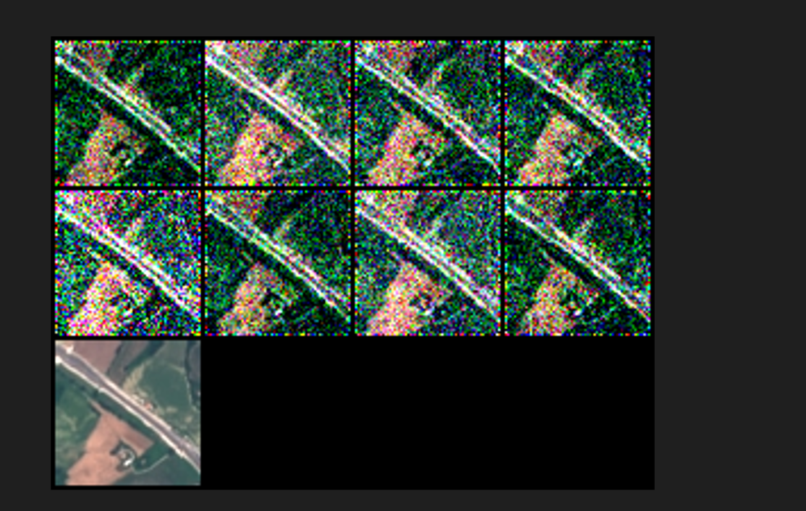
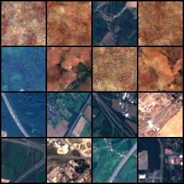
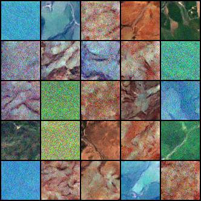

# DDPM for maps

<!-- #region -->
<p align="center">

</p>

ЗАДАЧА.

Адаптировать код для диффузионной модели для генерации карт.
-  Репозиторий с моделью: https://github.com/cloneofsimo/minDiffusion
-  Изображения с картами : https://github.com/chrieke/awesome-satellite-imagery-datasets

Был выбран датасет EuroSAT (RGB color space images) - набор данных о классификации землепользования и растительного покрова на основе спутниковых снимков Sentinel-2.(http://madm.dfki.de/downloads) 

Из него были выбраны 4 класса для обучения генеративной модели: Higway,HerbaceousVegetation,River и Pasture.

Итоговый датасет имеет объём 10000 RGB изображений размером 64x64. 

Чтобы подготовить DDPM к обучению на этом наборе данных, было необходимо приспособить class Dataset для этого датасета, что и было сделано:


```
$ class MapsDataset(Dataset):
    """ Highway maps dataset."""

    def __init__(self, root_dir, transform=None):
        """
        Args:
            root_dir (string): Directory with all the images.
            transform (callable, optional): Optional transform to be applied
                on a sample.
        """
        self.root_dir = root_dir
        self.transform = transform
        self.im_names = os.listdir(self.root_dir)

    def __len__(self):
        return len(self.im_names)

    def __getitem__(self, idx):
        if torch.is_tensor(idx):
            idx = idx.tolist()

        img_name = os.path.join(self.root_dir,
                                self.im_names[idx])
        image =torchvision.io.read_image(img_name)/255

        if self.transform:
            image = self.transform(image)

        return image
```

Также было добавленно в обработку изображений при обучении RandomVerticalFlip, RandomHorizontalFlip

```
$         tf = transforms.Compose(
            [transforms.Normalize((0.5, 0.5, 0.5), (0.5, 0.5, 0.5)),
             transforms.RandomVerticalFlip(),
             transforms.RandomHorizontalFlip()
            ])
```


Для первоначальной проверки работоспособности модели , она была запущена на 5000 итераций на одном изображении:

Нижний ряд содержит только исходник. Исходя из результата было принято решение, что модель рабочая.

<p align="center">

</p>

Далее была обученна модель на 2500 картинках из класса Highway 100 эпох.
Здесь мы видим, что модели не хватило обучения, поэтому было принято решение увеличить количество шагов обучения.
Два нижних ряда - это изображения из сходного набора карт.

<!-- #region -->
<p align="center">

</p>

В конечном счёте модель была обучена на датасете из всех 4 классов состоящем из 10000 картинок

Выбор параметров для неё основан на статье https://arxiv.org/pdf/2006.11239.pdf.

- batch_size = 128 (максимальный, который можно использовать для даного набора данных на доступном мне GPU).
- learning rate = 5e-5 (но для последних 10 эпох был уменьшен до 1e-5).
- decay factor = 0.96 (в статье авторы брали 0.999, но я решил остановиться на 0.96 , небольши изменения этого параметра к значимому улучшению не приводили).
- Параметры DDPM были не тронуты и остались такими же как и в статье упомянутой ранее.

Обучение:

- Было запущено 100 эпох с lr = 5e-5 и ещё 10 с lr = 1e-5.	
- В обоих случаях были включеный повороты изображения.

Итог генерирования 25 изображений:


<!-- #region -->
<p align="center">

</p>

Обучение заняло 4,5 часа на GPU googleColab.

